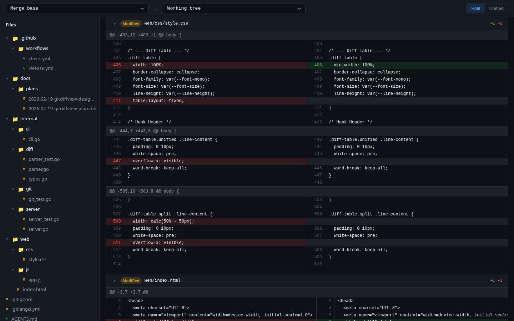

# diff-ashref-tn

> 🔀 Based on [ghdiff](https://github.com/johanlundberg/ghdiff) by Johan Lundberg

A web-based diff viewer with GitHub-style UI. Compare text, code, or files side-by-side with syntax highlighting.



## Credits

This project is built upon the excellent [ghdiff](https://github.com/johanlundberg/ghdiff) by Johan Lundberg. Original features include:

- Split and unified diff views with syntax highlighting
- File tree sidebar with collapsible folders
- Dark GitHub-style theme
- Zero external Go dependencies
- Single binary with embedded frontend

## License

See [LICENSE](LICENSE) file. Original work by Johan Lundberg.

---

## Development

```sh
make check    # lint + test (run before submitting)
make test     # go test ./...
make lint     # golangci-lint run ./...
make fmt      # goimports via golangci-lint
make build    # go build -o ghdiff .
```

Run a single test:

```sh
go test ./internal/diff/ -run TestParse
go test ./internal/server/ -run TestAPIDiff
go test -run TestIntegrationGitMode
```

Integration tests build the binary and start it as a subprocess. They are
skipped with `go test -short ./...`.

### Project structure

```
main.go              Entry point, server startup, signal handling
internal/cli/        CLI argument parsing, Config struct
internal/diff/       Unified diff parser
internal/git/        Git subprocess wrapper
internal/server/     HTTP server, API endpoints, auth
internal/browser/    Cross-platform browser opener
web/                 Embedded frontend (HTML, CSS, JS)
web/vendor/          Vendored highlight.js
```
